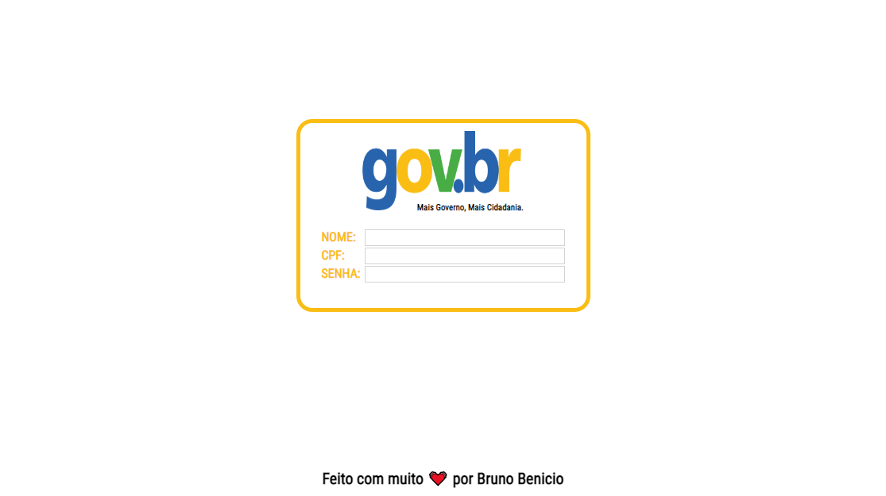

<h1 align="center"> Card Gov.br </h1>

  <a href="#-tecnologias">Tecnologias</a>&nbsp;&nbsp;&nbsp;|&nbsp;&nbsp;&nbsp;
  <a href="#-projeto">Projeto</a>&nbsp;&nbsp;&nbsp;|&nbsp;&nbsp;&nbsp;
  <a href="#-layout">Layout</a>&nbsp;&nbsp;&nbsp;&nbsp;&nbsp;&nbsp;

### Link da página: [Clique aqui](https://carecsnay.github.io/Card-GOV.BR/).

  <h3 align="center"> Preview do Site</h3>
  
  
  <h3 align="center"> Video de Demonstração</h3>
  

https://user-images.githubusercontent.com/53373326/233070819-f15fcd1c-ffb4-485c-bb22-38f9ac2fd706.mp4

## 🚀 Tecnologias

Esse projeto foi desenvolvido com as seguintes tecnologias:

- HTML5 
- CSS3
- Biblioteca de Terceiros (IMask)

## 💻 Projeto

Página para ajudar a guardar informações impressas de contas do GOV.BR. 

Preencha e imprima facilmente o seu cartão. 

O intuito do projeto foi agilizar a criação de cartões para clientes do escritório onde trabalho.

---

Feito com ❤️ por Bruno Benicio
